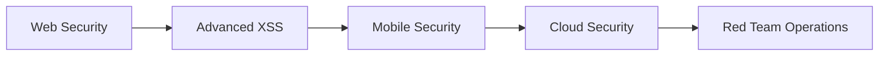

# 👋 Hi, I'm Jose Guzman (@joseguzman1337)

<div align="center">
  
</div>

## 🛡️ About Me

🔍 **Cybersecurity Professional** specializing in offensive security, vulnerability research, and automated threat detection

- 🎯 **Bug Bounty Hunter** actively participating in vulnerability disclosure programs
- 🏴‍☠️ **CTF Player** constantly learning through Capture the Flag competitions  
- 🔬 **Security Researcher** focusing on web application vulnerabilities and XSS exploitation
- 🤖 **Purple Team Engineer** developing automation tools for security operations
- 🎓 **Continuous Learner** studying advanced ethical hacking methodologies

## 🛡️ XSS Research & Findings

-  🛡️ Pop-up window stored XSS via

[](https://joseguzman1337.github.io)

## 🚀 Current Focus

```javascript
const currentWork = {
    research: ["XSS Vulnerabilities", "Web App Security", "OWASP Top 10"],
    platforms: ["HackerOne", "Bugcrowd", "TryHackMe", "HackTheBox"],
    learning: ["Advanced Penetration Testing", "Red Team Operations"],
    building: ["Security Automation Tools", "Vulnerability Scanners"]
};
```

## 🛠️ Technical Arsenal

<div align="center">

### Security Tools


### Programming & Scripting


### Operating Systems


</div>

## 📊 GitHub Activity

<div align="center">
  
  
</div>

## 🏆 Achievements & Certifications

- 🥇 **HackerOne Profile**: [akax](https://hackerone.com/akax/)
- 🎖️ **Bug Bounty Findings**: XSS vulnerabilities, Authentication bypasses
- 📜 **Security Certifications**: [In Progress]
- 🏅 **CTF Participation**: Regular competitor in cybersecurity challenges

## 🌐 Connect & Collaborate

<div align="center">

[](https://joseguzman1337.github.io)
[](https://hackerone.com/akax/)

</div>

## 💡 Featured Projects

<div align="center">

| Project | Description | Tech Stack |
|---------|-------------|------------|
| 🔍 **Web Vulnerability Scanner** | Automated XSS detection tool | Python, Selenium |
| 🛡️ **Security Automation Scripts** | Purple team automation utilities | PowerShell, Python |
| 📊 **Threat Intelligence Dashboard** | Real-time security monitoring | JavaScript, APIs |

</div>

## 📈 Current Learning Path



## 🤝 Looking to Collaborate On

- 🎯 **Bug Bounty Programs** - Joint vulnerability research
- 🏗️ **Security Tool Development** - Open source security projects  
- 📚 **Educational Content** - Security awareness and training
- 🔬 **Research Projects** - Novel attack vectors and defenses

---

<div align="center">
  
  
  **"Security is not a product, but a process."** - Bruce Schneier
</div>
