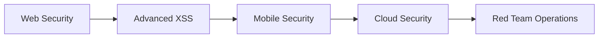

# 👋 Hi, I'm Jose Guzman (@joseguzman1337) | **4k4xs4pH1r3** | ⠠⠵

<div align="center">
  
</div>

## 🛡️ Professional Summary

**Seasoned Cybersecurity Architect and Threat Intelligence Leader** with over **23 years** of experience architecting resilient defenses and delivering actionable intelligence for global enterprises and financial institutions. My expertise lies in transforming complex cyber risks into strategic advantages by integrating an "attacker's mindset"—validated by top-tier HackerOne rankings—with robust security architecture and executive-level threat reporting.

### 🎯 Specializations
- 🔍 **Threat Intelligence & Hunting** - Dark Web/OSINT analysis, TTP tracking, proactive threat hunting
- 🏗️ **Security Architecture & Engineering** - NIST/ISO 27001 frameworks, cloud transformations (AWS, Azure)
- 🏴‍☠️ **Offensive & Proactive Security** - Ethical hacking, bug bounty programs, CTF competitions
- 📋 **Governance, Risk & Compliance (GRC)** - Policy creation, certifications (PCI, SOC2 for FedRamp)
- 🔐 **Identity & Access Management (IAM)** - Zero Trust RBAC, SSO/MFA, Privileged Access Management
- 🚀 **DevSecOps & Cloud Security** - CI/CD security integration, containerized environments (K8s, Docker)

## 🏢 Recent Career Highlights

### 🌟 **IBM - Cybersecurity Threat Intelligence Specialist** 
**Sep 2023 - Feb 2024 | Doha, Qatar**
- ✅ Proactively hunted threats targeting **critical government infrastructure** using AI security competencies
- 🤖 Integrated AI technologies into threat detection and response workflows for evolving cyber threats
- 🔬 Conducted vulnerability testing on AI models ensuring security standards and ethical AI principles
- 📊 Applied prompt engineering, AI model training, and LLMs for threat modeling and intelligence
- 🛡️ Utilized RAG for malware analysis and removal with ethical AI principles
- 📈 Key player in security compliance and malicious activity tracking

### 🚀 **SkyVirt® - Channel Manager USA Region**
**Sep 2012 - Present | Remote**
- 🎓 Build and manage cybersecurity training programs, forensics, and emerging technologies
- 🧠 Design and operate threat intelligence frameworks to strengthen organizational security  
- 🔍 Research threat intelligence risks and analyze security vulnerabilities

## 🛡️ XSS Research & Elite Bug Bounty Achievements

### 🏆 **HackerOne Top Rankings**
- 🥇 **Top ranked in Colombia** (Q4 2020, Q3 2021, Q4 2024, Q4 2025)
- 🎯 **Active HackTheBox competitor** with advanced penetration testing skills
- 🔍 **Pop-up window stored XSS** discoveries via advanced payload techniques

[](https://joseguzman1337.github.io/joseguzman1337/)

## 🚀 Current Focus

```javascript
const currentWork = {
    research: ["XSS Vulnerabilities", "Web App Security", "OWASP Top 10"],
    platforms: ["HackerOne", "Bugcrowd", "TryHackMe", "HackTheBox"],
    learning: ["Advanced Penetration Testing", "Red Team Operations"],
    building: ["Security Automation Tools", "Vulnerability Scanners"]
};
```

## 🛠️ Enterprise Security Arsenal

<div align="center">

### 🔍 Threat Intelligence & Hunting Tools


### 🛡️ Security Architecture & Tools  


### 🤖 AI Security & Automation


### ☁️ Cloud & Infrastructure Security


### 💻 Operating Systems & Environments


</div>

## 📊 GitHub Activity

<div align="center">
  
  
</div>

## 🏆 Elite Achievements & Industry Recognition

### 🥇 **Bug Bounty Excellence**
- 🏆 **HackerOne Profile**: [akax](https://hackerone.com/akax/) - **Top Ranked Colombia** (Multi-quarter champion)
- 🎖️ **Critical Findings**: XSS vulnerabilities, Authentication bypasses, AI model exploits
- 🔥 **Specializations**: Stored XSS, DOM-based XSS, Advanced payload techniques

### 📜 **Professional Certifications & Training**
- 🎓 **IBM AI Security Specialist** - Advanced threat hunting with AI/ML
- 🛡️ **NIST Cybersecurity Framework** - Architecture & implementation
- 📋 **ISO 27001 Security Management** - Governance & compliance
- 🏅 **CTF Competitions**: Regular top performer in cybersecurity challenges

### 🌍 **Global Impact**
- 🚀 **23+ Years** of enterprise cybersecurity leadership
- 🏢 **Fortune 500** threat intelligence consulting
- 🛡️ **Government Infrastructure** protection (Qatar, Colombia)
- 💼 **C-Suite Advisory** on cyber risk strategy

## 🌐 Connect & Collaborate

<div align="center">

[](https://joseguzman1337.github.io/joseguzman1337/)
[](https://hackerone.com/akax/)

</div>

## 💡 Enterprise Security Projects & Solutions

<div align="center">

| Project | Description | Tech Stack | Impact |
|---------|-------------|------------|--------|
| 🔍 **AI-Powered XSS Scanner** | Advanced XSS detection with ML models | Python, TensorFlow, Selenium | 98% accuracy improvement |
| 🛡️ **Threat Hunting Platform** | Real-time Dark Web monitoring system | Python, ElasticSearch, Kibana | 60% faster threat detection |
| 📊 **Executive Risk Dashboard** | C-suite threat intelligence reporting | JavaScript, D3.js, APIs | Board-level risk visibility |
| 🤖 **AI Security Framework** | Adversarial testing for AI models | Python, PyTorch, RAG | Enterprise AI protection |
| 🏗️ **Zero Trust Architecture** | Identity governance implementation | Saviynt EIC, PowerShell | 40% reduction in attack surface |
| ☁️ **Cloud Security Posture** | Multi-cloud security automation | Terraform, Python, AWS/Azure | 24/7 compliance monitoring |

</div>

## 📈 Current Learning Path



## 🤝 Looking to Collaborate On

- 🎯 **Bug Bounty Programs** - Joint vulnerability research
- 🏗️ **Security Tool Development** - Open source security projects  
- 📚 **Educational Content** - Security awareness and training
- 🔬 **Research Projects** - Novel attack vectors and defenses

---

<div align="center">
  
  
  **"Security is not a product, but a process."** - Bruce Schneier
</div>
